# AI-Ops-fullfil
> Practice and experience collection of AI Ops - Operational AI and Machine Learning Utilities

> This repository collect some experiences of AI Ops topic, including classification, anti-fraud, anomaly detection, 
time-series prediction, service logs analysis, LLM langchain use case and ML/AL databases and platform.
Most of them are useful in enterprise operation teams to handle their daily work cases using AI and ML mechanisms.
There are also some useful code gists, including both Python and Java for a reference.

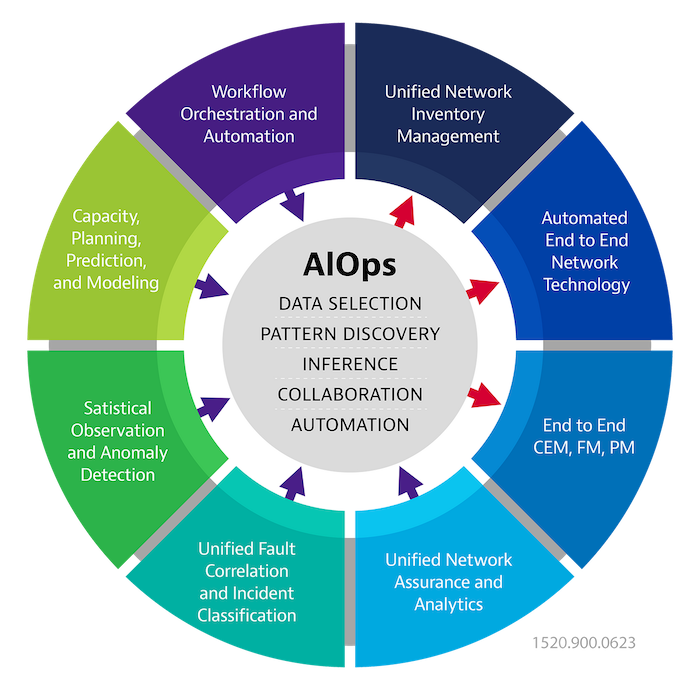

## Classification
> Classification is the most common case in data analysis, we ever used it to identify customers' service experience in a supervised way.
For structural dataset, tree-based model are most efficiency and scalable. We use XGBoost for such case.

[https://github.com/dmlc/xgboost](https://github.com/dmlc/xgboost)

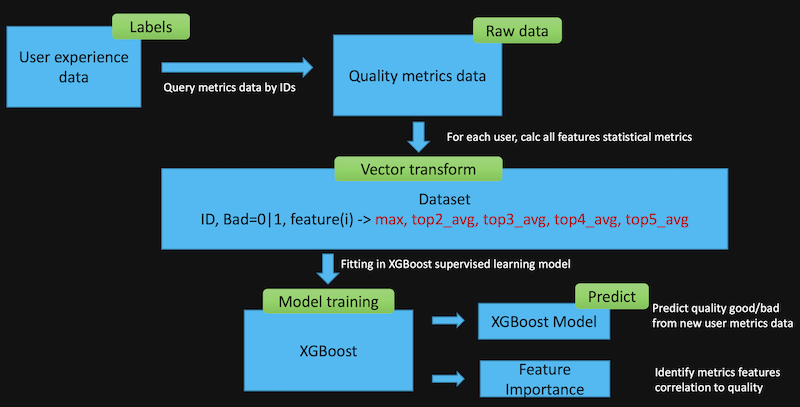

## Fraud Detection
> Fraud detection are widely required by service provider to identify fraudulent users and reduce loss of money.
There are three ways to implement:

### Anomaly detection for fraud detection
> Refer to the anomaly detection section below in this page.
By the way, anomaly detection in fraud, could result in many false negative alerts, 
if we want an accurate model, supervised learning should be used.

### Classification for fraud detection
> If we have a historical fraud dataset and features are clarified, XGBoost algorithm should be used.
One point to highlight is, fraud dataset always have data skew on volumes of fraud samples and legal samples.
That means, there are more legal samples in historical dataset than fraud samples. 
XGBoost has a hyper param "scale_pos_weight", which indicate high-class imbalance for faster convergence.
More, if we want to focus on the fraud samples accuracy, we must use a cross validation and calculate the fraud samples recall rate, 
and make sure model hyperparameters tuning should result in the best fraud sample recall.

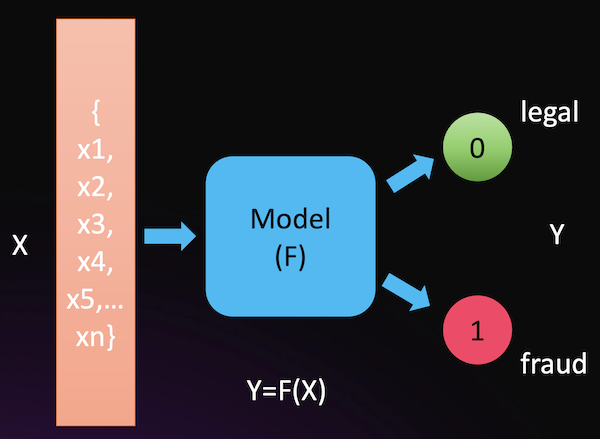

> XGBoost also can be integrated with Apache Flink and Apache Spark, we can build a real-time detection pipeline.

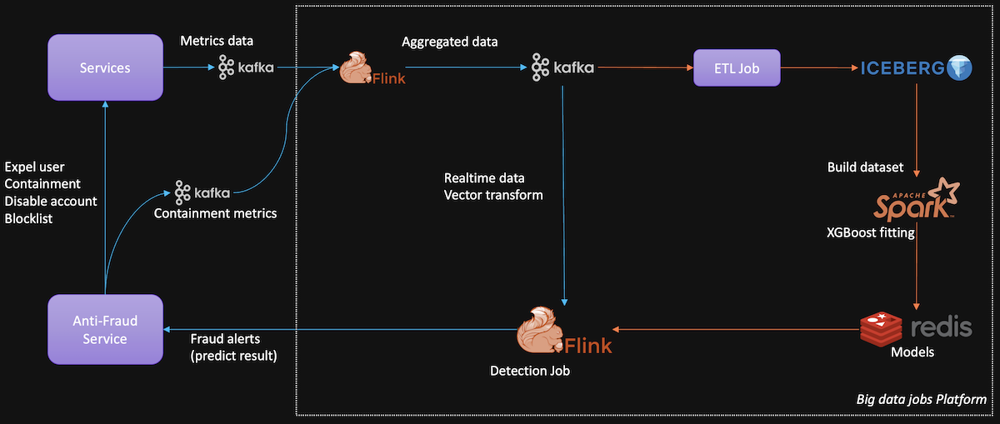

### LLM detect for fraud
> Someone use LLM to detect fraud, this focus on the fraud contextual identify.

[https://www.linkedin.com/pulse/fine-tuning-ai-models-creating-financial-fraud-detection-konda-ywdae/](https://www.linkedin.com/pulse/fine-tuning-ai-models-creating-financial-fraud-detection-konda-ywdae/)

## Anomaly Detection
> Anomaly detection are very useful in daily work of service maintain, as well as fraud detect.
Service metrics are monitored to track stability and make sure issue or incidents observation.

> Unsupervised learning case, extended isolation forecast is the most effectual anomaly detect algorithm.
And Pyod is a versatile Python library for detecting anomalies in multivariate data.

[https://github.com/sahandha/eif](https://github.com/sahandha/eif)

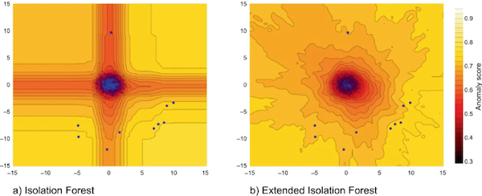

[https://github.com/yzhao062/pyod](https://github.com/yzhao062/pyod)

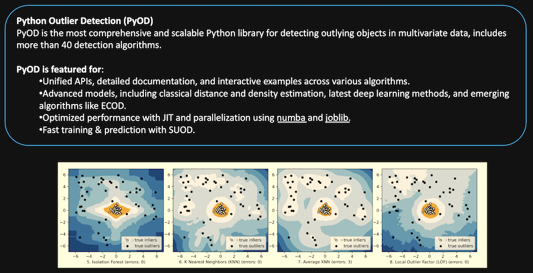

## Time Series Prediction
> Sometimes, we want to predict a time series metrics to get future values.
This is meaningful when we are estimating capacity growth or cost trending.
statsforecast is the most powerful time-series prediction lib we ever used.

[https://github.com/Nixtla/statsforecast](https://github.com/Nixtla/statsforecast)

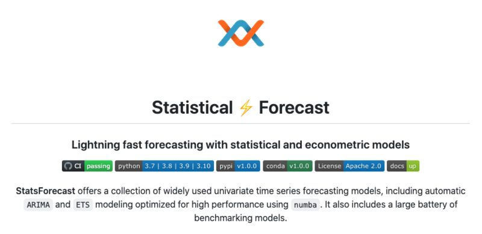

## Service Logs Analysis
> When we operate services, massive volume of logs are generated. 
How to analyze real-time and historical service logs to get insights for helping operation? 
Such as overall situation, service issue category identify, etc.
We use NLP to analyze services logs and fetch highlighted benefits.

[https://scikit-learn.org/stable/modules/generated/sklearn.feature_extraction.text.TfidfVectorizer.html](https://scikit-learn.org/stable/modules/generated/sklearn.feature_extraction.text.TfidfVectorizer.html)

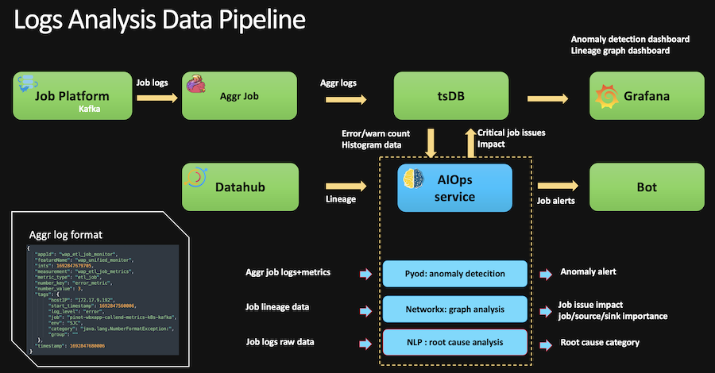

## LLM LangChain
> Large language model and LangChain available now. Big change in operations too.
We can use LLM to automatically triage service logs and indicate actions.
Also, we can build vector store persisting private knowledge documents and create help BOT that answer internal questions.

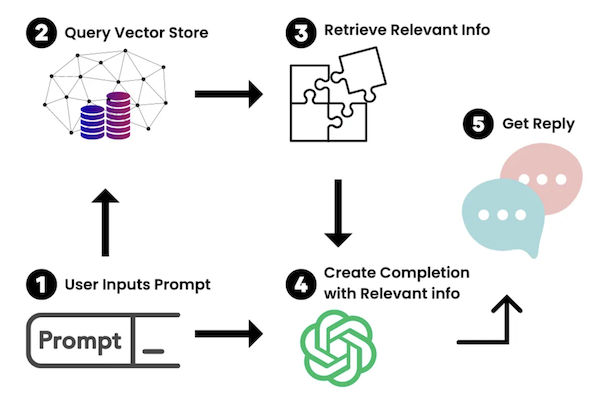

## AL ML Databases and Platforms
> When data are in databases or big data lakehouse, how do we connect data and ML/AL more tightly?
There are AL/ML databases and platforms to leverage.

### MindsDB

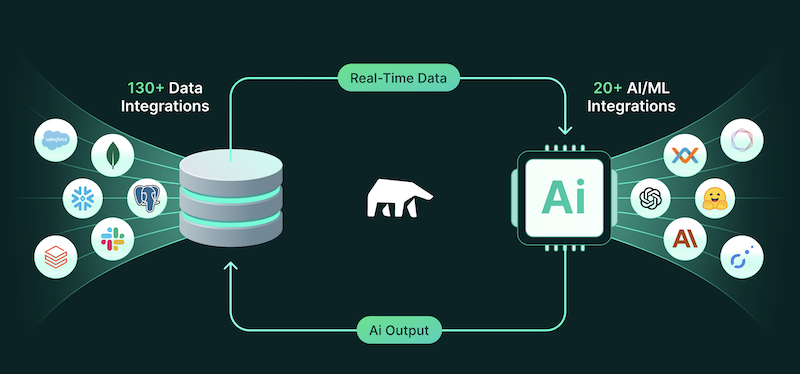

### Apache Ignite

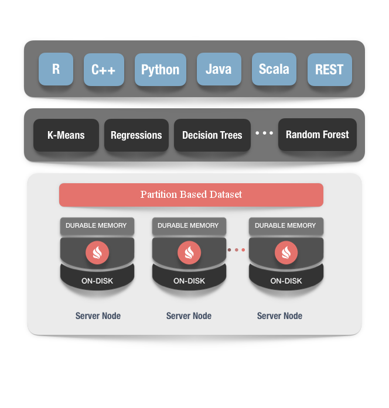

### Greenplum

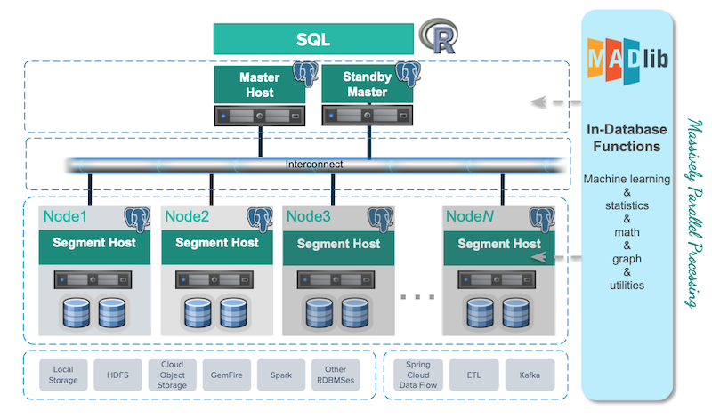

### h2o.ai

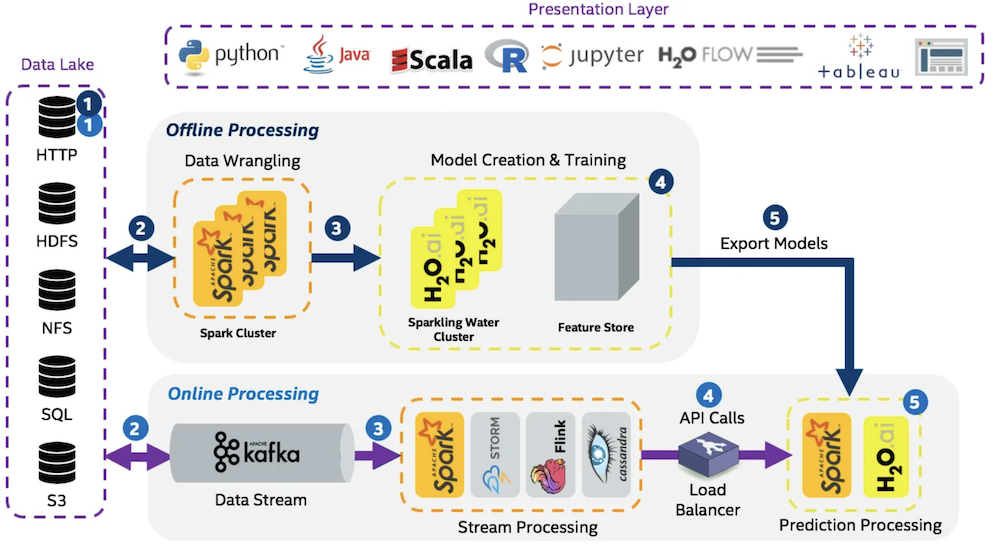