# AIOps Delight Copilot

AI-first data analysis workspace for AIOps datasets.

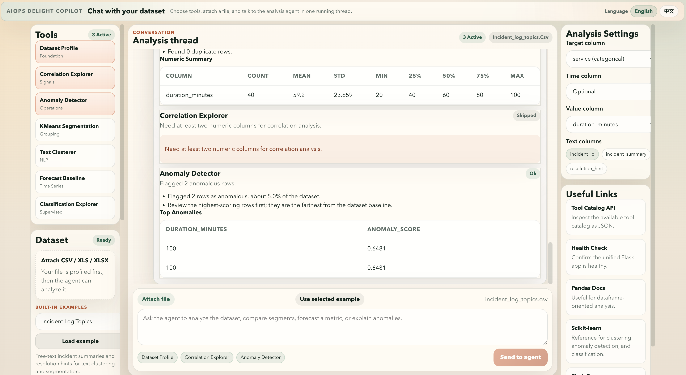

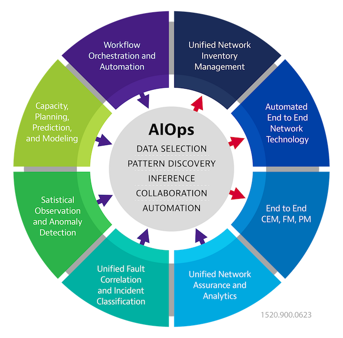

The project now uses the AI agent app as the primary surface:

- `frontend/`: Vue 3 chat-style analysis interface, built and served by Flask
- `backend/`: unified Flask app for API endpoints, Qwen-backed answers, and static frontend serving
- `tools/`: the original ML/AI scripts, experiments, and reference assets preserved as supporting tools

## What It Does

Upload a CSV or Excel file, or choose one of the built-in example datasets in the UI, then select the ML/AI tools you want to run, add a plain-language prompt, and let the agent analyze the dataset. The interface now supports English and Chinese switching, and the Qwen answer path follows the selected UI language.

Available analysis tools include:

- Dataset profiling
- Correlation exploration
- Isolation-forest style anomaly detection
- KMeans segmentation
- Text clustering with TF-IDF
- Baseline time-series forecasting
- Baseline classification exploration

## Project Structure

```text
AIOps-Delight/
├── backend/
│   ├── app.py
│   ├── analysis_tools.py
│   └── requirements.txt
├── frontend/
│   ├── src/
│   ├── package.json
│   └── vite.config.js
├── tools/
│   ├── python/
│   ├── java/
│   ├── anomaly-detection/
│   ├── fraud-detection/
│   ├── time-series-prediction/
│   └── ...
└── scripts/
    └── start/
        ├── backend.sh / backend.command / backend.bat
        ├── frontend.sh / frontend.command / frontend.bat
        └── start_all.sh / start_all.command / start_all.bat
```

## Run Locally

The app now has one production-style startup point: the unified Flask server on `http://127.0.0.1:5001`.

### Unified App

```bash
cd frontend
npm install
npm run build

cd backend
python3 -m venv .venv
source .venv/bin/activate
pip install -r requirements.txt
python3 app.py
```

This starts the only app runtime: Flask serves both the API and the built frontend from `frontend/dist`.

### Frontend Dev Only

```bash
cd frontend
npm install
npm run dev
```

`npm run dev` is still available for frontend-only development and proxies API requests to the Flask server on `http://127.0.0.1:5001`.

## Start Scripts

Startup scripts are now unified under `scripts/start/`.
The only real startup path is the unified Flask app.

### Linux

```bash
./scripts/start/start_all.sh
```

### macOS

```bash
./scripts/start/start_all.command
```

### Windows

```bat
scripts\start\start_all.bat
```

Notes:

- `start_all.*` is the main entrypoint on every platform.
- `frontend.*` builds the Vue assets only.
- `backend.*` builds the frontend and then starts the same unified Flask app.
- The Flask app serves both the API and the built SPA from `frontend/dist`.

## Optional Qwen LLM

If you want user questions to also get Qwen-generated chat answers, set:

```bash
export DASHSCOPE_API_KEY=your_key
export DASHSCOPE_MODEL=qwen-turbo
```

Without those variables, the app still performs the local data science analysis and returns deterministic fallback answers and summaries.

## Environment Variables

Use OS environment variables for external credentials. Do not hard-code secrets in the repository.

### Quick Start

```bash
cp .env.example .env
```

Then edit `.env` and fill in your real keys.

```bash
export DASHSCOPE_API_KEY=your_qwen_key
export DASHSCOPE_MODEL=qwen-turbo
export QIANFAN_BEARER_TOKEN=your_baidu_qianfan_bearer_token
```

`QIANFAN_BEARER_TOKEN` is used by the legacy news-search tools and by the backend `/api/news-search` proxy.

### Qwen Example

Project root `.env`:

```bash
PORT=5001
DASHSCOPE_API_KEY=sk-your-real-dashscope-key
DASHSCOPE_MODEL=qwen-turbo
```

After saving `.env`, restart the unified Flask app:

```bash
./scripts/start/start_all.sh
```

If `DASHSCOPE_API_KEY` is present, each user message will try to call Qwen and produce a natural-language answer in the chat.

## Legacy AIOps Reference

The following original repository content is preserved here for reference.

> Practice and experience collection of AI Ops - Operational AI and Machine Learning Utilities

This repository collected some experiences of AI Ops topic, including:

- Classification
- Anti-fraud
- Anomaly detection
- Time-series prediction
- Service logs analysis using NLP
- LLM langchain use cases
- ML/AI databases and platforms

Most of them are useful in enterprise operation teams to handle their daily work cases using AI and ML mechanisms.
There are also some useful code gists, including both Python and Java for a reference.


## Classification

> Classification is the most common case in data analysis

We ever used it to identify customers' service experience in a supervised way.

For **structural dataset**, tree-based model are most efficiency and scalable. We use **XGBoost** for such case.

[https://github.com/dmlc/xgboost](https://github.com/dmlc/xgboost)

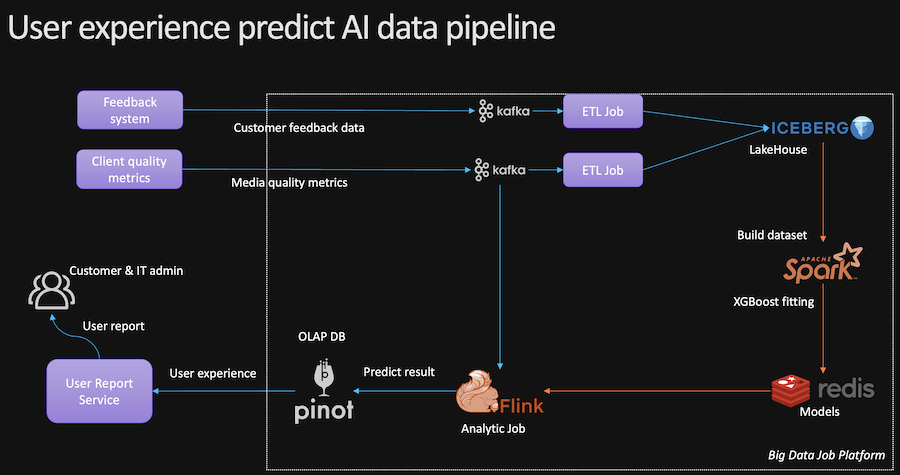

## Fraud Detection

> Fraud detection are widely required by service provider to identify fraudulent users and reduce loss of money.

There are three ways to implement:

### Anomaly detection for fraud detection

> Refer to the anomaly detection section below in this page.

By the way, anomaly detection in fraud, could result in many false negative alerts.

If we want an accurate model, **supervised learning** should be used.

### Classification for fraud detection

> If we have a historical fraud dataset and features are clarified, XGBoost algorithm should be used.

One point to highlight is, fraud dataset always have data skew on volumes of fraud samples and legal samples.
That means, there are more legal samples in historical dataset than fraud samples.

XGBoost has a hyper param **"scale_pos_weight"**, which indicate high-class imbalance for faster convergence.

More, if we want to focus on the fraud samples accuracy, we must use a **cross validation** and calculate the fraud samples **recall** rate,
and make sure model **hyperparameters tuning** should result in the best fraud sample **recall**.

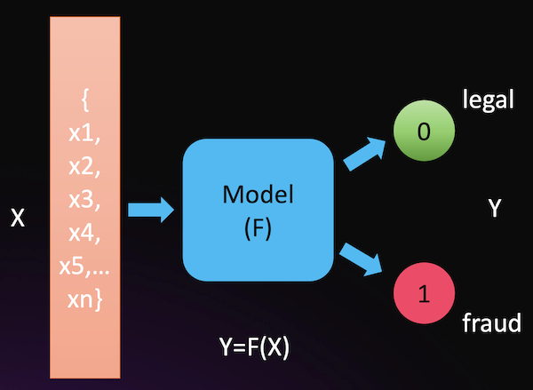

> XGBoost also can be integrated with **Apache Spark and Flink**, we can build a real-time detection pipeline.

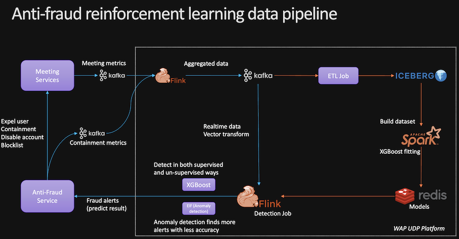

### LLM detect for fraud

> Someone use LLM to detect fraud, this focus on the fraud **contextual** identify.

[https://www.linkedin.com/pulse/fine-tuning-ai-models-creating-financial-fraud-detection-konda-ywdae/](https://www.linkedin.com/pulse/fine-tuning-ai-models-creating-financial-fraud-detection-konda-ywdae/)

## Anomaly Detection

> Anomaly detection are very useful in daily work of service maintain, as well as fraud detect.

Service and business metrics are monitored to track stability and make sure any **issues, abnormal or incidents** observation.

> Unsupervised learning case, **extended isolation forecast (EIF)** is the most effectual anomaly detect algorithm.

And **Pyod** is a versatile Python library for detecting anomalies in **multivariate** data.

[https://github.com/sahandha/eif](https://github.com/sahandha/eif)

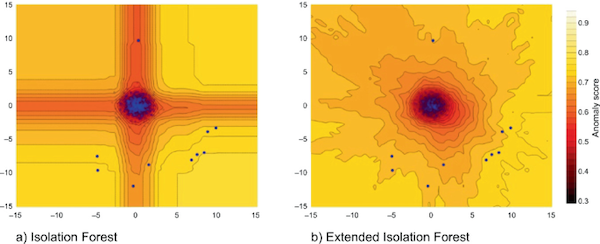

[https://github.com/yzhao062/pyod](https://github.com/yzhao062/pyod)

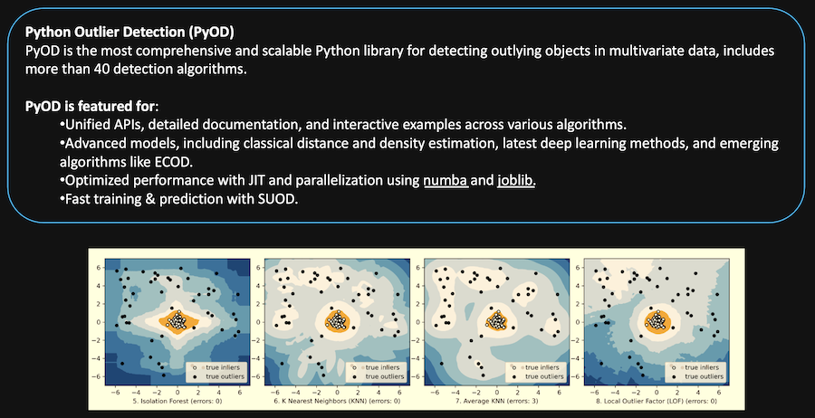

## Time Series Prediction

> Sometimes, we want to predict a time-series metrics to get future values.

This is meaningful when we are estimating capacity growth or cost trending.

**Statsforecast** is the most powerful time-series prediction lib we ever used.

[https://github.com/Nixtla/statsforecast](https://github.com/Nixtla/statsforecast)

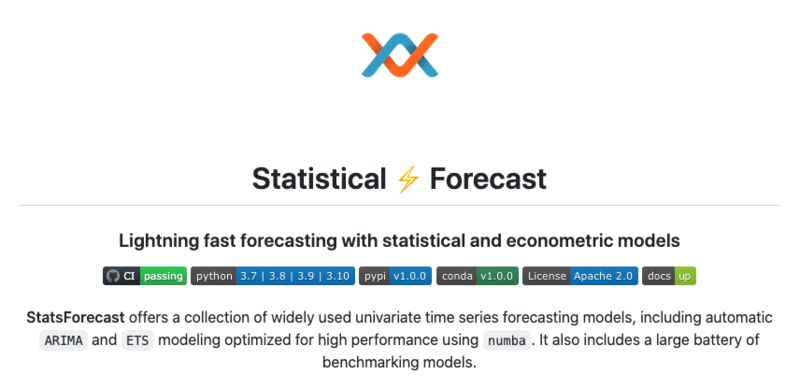

## Service Logs Analysis

> When we operate services, massive volume of **logs** in text format are generated.

How to analyze real-time and historical service logs to get insights for helping operation?
Such as overall situation, service issue category identify, etc.

We use **NLP** to analyze services logs and fetch highlighted benefits, including:

- Logs keywords extraction
- Logs clustering by keywords and text vectors
- Anomaly detection on keywords highlight trending

[https://scikit-learn.org/stable/modules/generated/sklearn.feature_extraction.text.TfidfVectorizer.html](https://scikit-learn.org/stable/modules/generated/sklearn.feature_extraction.text.TfidfVectorizer.html)

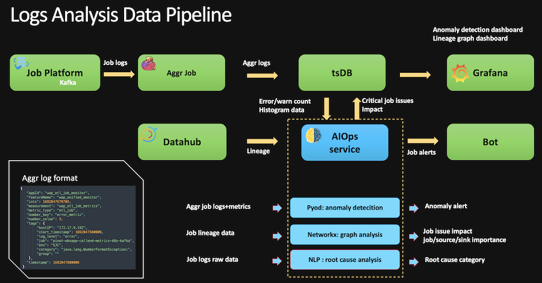

## LLM LangChain

> Large language model and LangChain available now. And big change in operations too.

We can use **LLM** to automatically triage service logs and indicate actions.

Also, we can build **vector store** persisting private knowledge documents and create help BOT that answer internal questions.

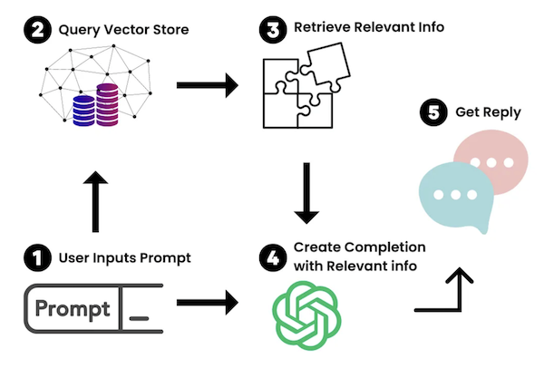

## ML/AI Databases and Platforms

> When data are in databases or big data lakehouse, how do we connect data and ML/AI more tightly?

There are AL/ML databases and platforms to leverage.

### MindsDB

[https://github.com/mindsdb/mindsdb](https://github.com/mindsdb/mindsdb)

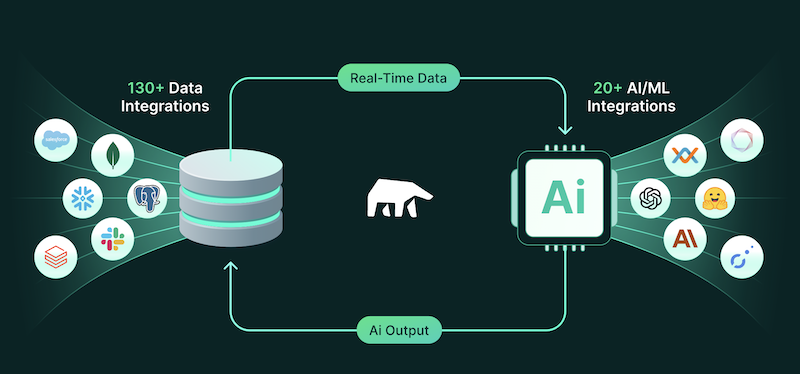

### Apache Ignite

[https://github.com/apache/ignite](https://github.com/apache/ignite)

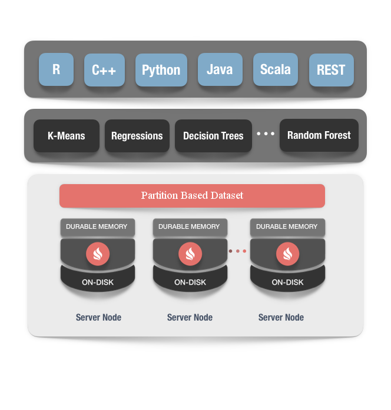

### Greenplum

[https://github.com/greenplum-db/gpdb](https://github.com/greenplum-db/gpdb)

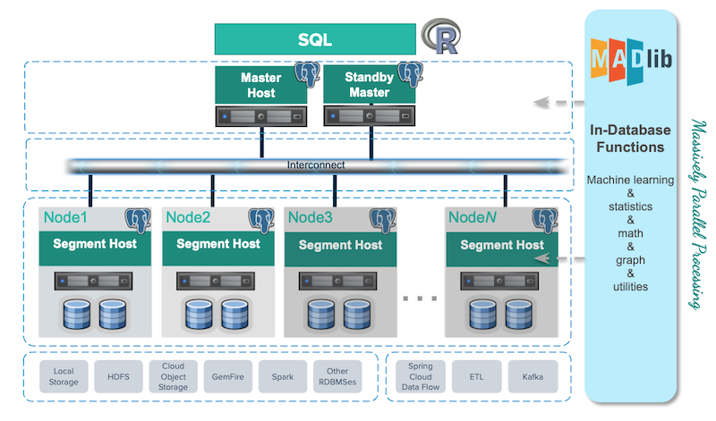

### h2o.ai

[https://github.com/h2oai](https://github.com/h2oai)

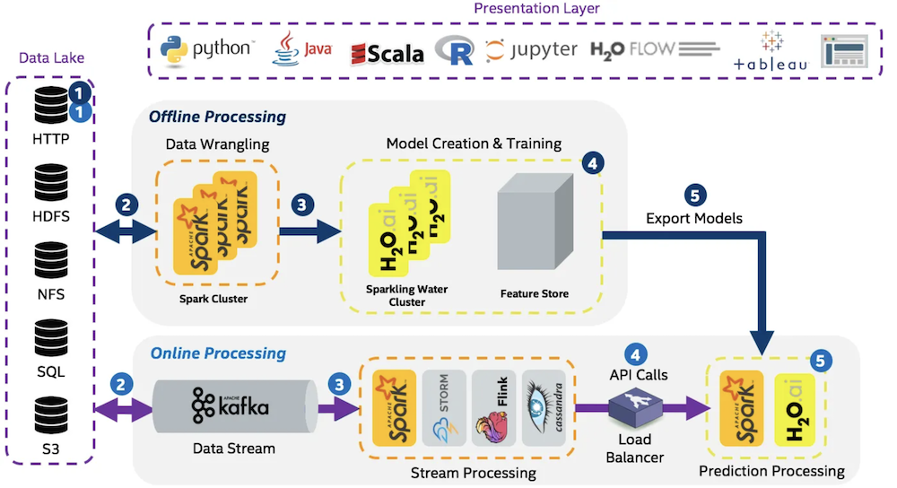
